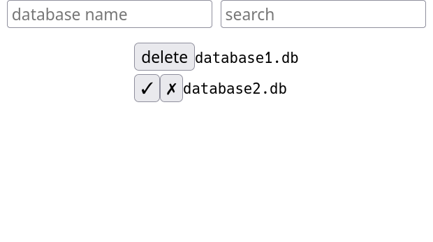

# sqlite-editor

A web interface to create, search and delete SQLite databases



### About 

**Technologies** 

This application was implemented using:

- Express - routes for get/post requests
- EJS - templates (i.e. header/footer)
- SQlite - databases 

**Functionality**

Create a database by typing a desired name into the 'database name' field and pressing 'Enter' (Note: A database cannot be created if a database with the same name has already been created).

Delete a database by clicking the delete button next to the corresponding database. Confirm the deletion by selecting the check button and dismiss by click the 'x'. 

Typing into the 'search' field will cause existing databases to be filtered to only show databases the match the search query. 

### Installation

```
git clone git@github.com:benjaminarnett/sqlite-editor.git
cd sqlite-editor
npm start
```
Go to [localhost:3000](localhost:3000) in the  browser to view the interface.
